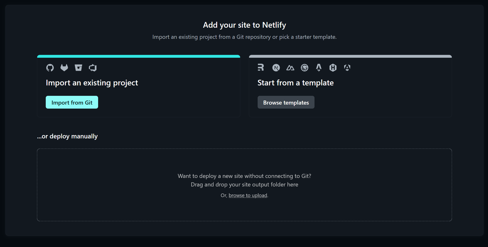

# Capítulo V: Product Implementation, Validation & Deployment
## 5.1. Software Configuration Management.
En la siguiente sección, detallaremos las herramientas, convenciones, referencias y configuraciones empleadas a lo largo del desarrollo del proyecto, que contribuyeron a mantener la consistencia en el trabajo realizado.

### 5.1.1. Software Development Environment Configuration.
En este apartado, se mencionarán los distintos productos de software empleados por el equipo de desarrollo, para llevar acabo las actividades relacionadas con la elaboración del proyecto.

 

**Project Management**
1.	Google Docs:  https://docs.google.com/

    Google Docs es una plataforma web que facilita la creación de documentos para compartir y editar de forma conjunta con otros usuarios de manera sincrónica. Se utilizo para designar, organizar y hacer un seguimiento de las actividades de trabajo, así como para establecer plazos de entrega.

2.	Google Meet: https://meet.google.com/

    Google Meet es una plataforma de videoconferencias que permite realizar videollamadas con multiples participantes y programar sesiones de trabajo. Se usó como herramienta para llevar a cabo las reuniones del equipo, facilitando la comunicación entre los integrantes del proyecto.

**Requirements Managements**
1.	Trello: https://trello.com/ 

    Es un software de gestión de proyectos, que facilita asignar y organizar las tareas a realizar. Fue utilizado para el Product Backlog.

**Product UX/UI Design** 

1.  UXPressia: https://uxpressia.com/ 

    Es una herramienta en línea que permite a los equipos de trabajo identificar y comprender los problemas, necesidades y comportamiento del usuario en relación a la solución de software que se está desarrollando, con el uso de plantillas. Se usó para la elaboración de los User Personas, Empathy Maps, Journey Maps e Impact Maps.

2.	Figma: https://www.figma.com/ 

    Figma es una herramienta de edición gráfica, en donde se puede diseñar y prototipar páginas web y aplicaciones de manera colaborativa en tiempo real. Se utilizó para crear los wireframes, mock-ups y los desktop and mobile application prototype del proyecto.

3.	Miro: https://miro.com/ 

    Es una plataforma colaborativa el cual permite crear y usar pizarras digitales personalizadas en tiempo real. Miro cuenta con distintas herramientas y plantillas para la elaboración de mapeos, diagramas, flujos de trabajo, etc. En el desarrollo del proyecto, se empleó para la creación de los As-Is y Tob-Be Scenario Maps.

**Software Development** 
1.	Landing Page
    
    Para la creación de la landing page, se utilizaron las tecnologías base del desarrollo web: HTML5, CSS3 y JavaScript. También se usó los frameworks Tailwind CSS y Alpine.js para facilitar el desarrollo del proyecto.

2.	Frontend Web Applications

    En el caso de la aplicación web, además de HTML5, CSS3 y JavaScript. En el caso de los componentes, se usó Angular Material.

3. Web Services

    Para el servicio web, se empleó Java junto al framework Spring Boot. En el caso de la arquitectura, se optó por un RESTful API style.

**Software Deployment**
1. Netlify: https://www.netlify.com/

    Netlify es una plataforma de despliegue de páginas y aplicaciones web, integrandose con repositorios en Git. Se usó para hospedar la landing page del proyecto.

**Software Documentation**
1.	Vertabelo: https://vertabelo.com/

    Es una herramienta online que facilita el diseño, creación y gestión de bases de datos de manera colaborativa. Se usó para diseñar la base de datos del proyecto.

2.	LucidChart: https://lucid.app/   
    
    LucidChart es una plataforma que cuenta con opciones para la creación de diagramas, mapas mentales, flujos y más, con el uso de plantillas y tableros con edición en tiempo real. Fue utilizado en el desarrollo del diagrama de clases UML, así como los Wireflows y User Flows.

3.	Structurizr: https://www.structurizr.com/ 

    Es una plataforma que permite modelado de diagramas de arquitectura de software por medio de código. Structurizr fue utilizado para crear el modelo C4 de nuestro proyecto.         

### 5.1.2. Source Code Management.
Para el desarrollo y gestión del proyecto, fue creado una organización mediante GitHub, donde se registró todas las modificaciones realizadas a lo largo de su ciclo de vida. Este fue estructurado de la siguiente manera:
- **Organization**: https://github.com/Open-Source-SW54-Group-3-ArtCollab 
- **Landing Page Repository**: https://github.com/Open-Source-SW54-Group-3-ArtCollab/Landing-Page 
- **Report Repository**: https://github.com/Open-Source-SW54-Group-3-ArtCollab/Report 

Por otra parte, para controlar de manera efectiva los cambios en el código de la aplicación y gestionar las ramas por cada repositorio, se ha implementado GitFlow para definir y estructurar nuestro flujo de trabajo. Esto involucra la creación de dos ramas principales:
- **main**: También denominada "master", es la rama donde se encuentra la versión más estable y lista del proyecto que van a pasar a producción.
- **develop**: Es la rama donde se integra el contenido de las features. Va paralela al main. 

**Ramas auxiliares:**

- **feature**: Son las ramas donde se desarrollan las funcionalidades del proyecto. Luego de completarlas, se fusionan con la rama develop.

    El formato de nomenclatura usado para las ramas ha sido la siguiente: feature/feature-name. Aquí, "feature" indica la rama y "feature-name" el nombre de la funcionalidad que se está desarrollando. Por ejemplo, feature/log-in, se refiere a la login de la web application.

- **release**: Son las ramas donde se prepara la próxima versión del programa. En esta, se realizan las pruebas finales y se corrigen pequeños errores antes del lanzamiento definitivo. Finalizado este proceso, los cambios se fusionan con la rama develop, y luego a la rama main. 

    Se utilizó el formato "Semantic Versioning 2.0.0" para la nomenclatura de las versiones del proyecto, por ejemplo: "release/x.y.z". En donde:

    - X, Y y Z son números enteros positivos, donde cada uno se incrementa de manera numérica. 
    - X: Es la versión mayor. Cada incremento elimina la compatibilidad con versiones anteriores. Esto implica reiniciar a 0 las versiones menores y parche. 
    - Y: Es la versión menor. Cada incremento implica que se ha introducido funcionalidades que sí son compatibles con versiones anteriores. Cada vez que Y se incremente, la versión parche se reiniciará a 0.
    - Z: Es la versión parche. Solo se incrementa cuando se realizan correciones que son compatibles con versiones anteriores.

- **hotfix**: Son las ramas que se utilizan corregir errores críticos ocurridos en producción y que necesitan ser resueltos urgencia. Se originan de la rama main y se fusionan tanto con esta como con la rama develop.
 

**Commit Conventions**

Para el formato de los commits se siguió la estructura de Conventional Commits 1.0.0, la cual tiene la siguiente estructura:
    
    < type > [optional scope]: < description >

    [optional body]

    [optional footer(s)]

Donde:
- type: Indica el tipo de cambio realizado. Entre los valores permitidos se tienen: fix, feat, build, chore, ci, docs, style, refactor, perf, test, entre otros.
- scope: Indica dónde se realizó el commit en el proyecto. Ayuda a dar dar el contexto y alcance del cambio. Es opcional.
- description: Menciona de manera breve los cambios en el código. 

### 5.1.3. Source Code Style Guide & Conventions.
Para el desarrollo del código en HTML y CSS se decidió seguir la convención de Google HTML/CSS Style Guide. Entre las más importantes destacan:
- Se debe declarar el tipo de documento al principio del archivo con <!DOCTYPE html>.
- Indicar los meta tags 
- El elemento &lt;title&gt; se debe ubicar entre las etiquetas < head >.
- La identación es de dos espacios a la vez.
- Usar solo minúsculas para los elementos HTML, atributos, propiedades, valores y selectores CSS.
- Encerrar entre comillas a los atributos de los elementos HTML.
- Cada elemento HTML debe tener su etiqueta de cierre.
- Evitar largas líneas de código.
- Indicar el ancho y alto de las imágenes, así como el texto alternativo (*alt*).

Para el desarrollo del código en JavaScript, se eligió la convención Google Java Style Guide. Algunas de estas convenciones son: 
- Cada línea de código debe terminar con un punto y coma (;).
- Tanto las variables como funciones deben estar en Camelcase.
- Los valores strings deben estar entre comillas simples.
- La identación del contenido es de +2.
- Se debe evitar definir variables con la sentencia *var*. En su lugar, se recomienda *let* y *const*.

Para el desarrollo de los aceptance test con el leguaje Gherkin, se seleccionó “Gherkin Conventions for Readable Specifications”. Entre ellas están:
- Para describir los pasos del escenario, utilizar las palabras "Give", "When", "Then" y "And".
- Identar los pasos que comienzan con "And".
- Agregar líneas entre pasos.
- Encerrar entre comillas simples los parámetros.
- Usar un comentario separador y dos líneas en blanco entre cada escenario.

Para el desarrollo del código en Java, se seleccionó como convención estándar el Google Java Style Guid. Entre las más importantes destacan:
- Los nombres de los paquetes deben estar en minúsculas, las clases se escriben usando UpperCamelCase y lo métodos con lowerCamelCase.
- No se tabula para las indentaciones. Debe haber 2 o 4 espacios.
- Dividir las líneas de código de más de 100 caracteres.
- Los archivos Java deben tener el mismo nombre de la clase que contienen y está debe ser única y pública. 
- Luego de cada declaración, se hace un salto de línea.

### 5.1.4. Software Deployment Configuration.
En este apartado, detallaremos los pasos realizados para el despliegue de la Landing Page utilizando el servicio Netlify.

1. Luego de acceder a https://www.netlify.com/ e iniciar sesión o crear una cuenta, nos dirigimos al apartado "Sites", ubicado en el panel de control lateral.

    
    <h4> Barra lateral de Netlify con la opción 'Sites' seleccionada </h4>

2. Dentro de la sección Sites, tendremos tres opciones diferentes. En nuestro caso, seleccionamos la opción "Import from git" para importar la landing page directamente desde nuestro repositorio.

    
    <h4> Sección 'Add your site to Netlify' con la opción Import from Git seleccionada </h4>

3. Ahora nos pedirá elegir nuestro proveedor de Git. Para este trabajo, el equipo ha manejado GitHub, por lo que seleccionaremos "Deploy with GitHub". 

    
    <h4> Sección de 'Let's deploy' your project de Netlify con la opción Deploy with GitHub seleccionada </h4>

4. Netlify pedirá permisos en GitHub. Luego seleccionaremos la organización donde queremos instalar Netlify y qué repositorio queremos vincular.

    
    <h4> Pantalla en GitHub para seleccionar la organización para instalar Netlify </h4>

5. Por último, indicamos el nombre con el que se desplegará la landing page y la rama para el deploy (develop). Finalmente le damos click a "Deploy artcollab"

    
     <h4> Primera parte de la configuración del deploy de la Landing Page en Netlify </h4>
    
     <h4> Segunda parte de la configuración del deploy de la Landing Page en Netlify con la opción de 'Deploy artcollab' seleccionada </h4>

## 5.2. Landing Page, Services & Applications Implementation.

### 5.2.1. Sprint 1

### 5.2.1.1. Sprint Planning 1 

<table>
     <tr> 
        <th>  Sprint #  </th>
        <th> Sprint 1 </th>
     </tr>
     <tr> 
        <td style="font-weight: bold;" colspan="7"> Sprint Planing Background</td>
     </tr>
     <tr>
       <td style="font-weight: bold;"> Date </td>
       <td> 27/03/2024 </td>
     </tr>
     <tr>
       <td style="font-weight: bold;"> Time </td>
       <td> 14:00 horas (GMT-5) </td>
     </tr>
     <tr>
       <td style="font-weight: bold;"> Location </td>
       <td> Modalidad remota a traves de la plataforma Google Meets <td>
     </tr>
      <tr>
        <td style="font-weight: bold;"> Prepared By </td>
        <td> Amaro Villanueva, Camila Elena <td>
     </tr>
        <tr>
        <td style="font-weight: bold;"> Attendees (to planning meeting) </td>
        <td> Amaro Villanueva, Camila Elena
         
          Jave Diaz, Mathias Alejandro 
            
         Cuadros Rodriguez, Juan Alejandro 
           
           Luna Capuñay, Italo D'Alessandro
           
         Huilca Chipana, Gustavo 
               
         Alvarez Araguache, Samira Jetzabel
         <td>
     </tr>
     <tr>
        <td style="font-weight: bold;"> Sprint 0 Review Summary </td>
        <td> Dado que es nuestro primer sprint de desarrollo no existe 
        un review summary del sprint <td>
     </tr>
     <tr>
        <td style="font-weight: bold;"> Sprint 0 Retrospective Summary </td>
        <td> Dado a que nos encontramos en nuestro primer sprint aun no identifcamos planes de mejora.<td>
     </tr>
     <tr> 
        <td style="font-weight: bold;" colspan="7"> Sprint Goal & User Stories</td>
     </tr>
       <tr>
          <td style="font-weight: bold;"> Sprint 1 Goal</td>
          <td>  En este sprint se espera implementar el landing page con las secciones de login de inicio, hero y secciones de orientacion para el usuario, como por ejemplo footer y conocemos. En el grupo acordamos usar el framework de Tailwind.css para mejorar el maquetado y estilos de nuestra landing page, como tambien las librerias de Alpine.js y Swiper.js para facilitar la implementacion de las secciones de navbar y conocenos. Al finalizar este sprint la landing page debe estar desplegado en Netlifly y cualquier usuario deberia poder acceder y visualizar la pagina a traves de un link. <td>
      </tr>
       <tr>
          <td style="font-weight: bold;"> Sprint 1 Velocity </td>
          <td>  19  <td>
      </tr>
      <tr>
          <td style="font-weight: bold;"> Sum of Story Points </td>
          <td> 19 <td>
      </tr>

  </table>

### 5.2.1.2. Sprint backlog 1

### 5.2.1.3. Development Evidence for Sprint Review.

### 5.2.1.4. Testing Suite Evidence for Sprint Review. 

### 5.2.1.5 Execution Evidence for Sprint Review.

 Para esta entrega, el equipo ArtCollab logró implementar exitosamente el landing page, en la cual se brindarán información especifica para conocer nuestra misión como startup, asi como también los servicios que ofrecemos en nuestra aplicación web. 

Enlace del deploy de la landing page mediante Netlify: https://stalwart-peony-7df718.netlify.app/

   <h4> Hero en versión desktop </h4>
   

    <h4 style=" padding-top:10px;" > Hero en versión mobile (dropdown desactivado) </h4>
   

    <h4 style=" padding-top:10px;" > Hero en versión mobile (dropdown activado) </h4>
   

    <h4 style=" padding-top:10px;" > Explora en versión desktop </h4>
   

    <h4 style=" padding-top:10px;" > Explora en versión mobile </h4>
   

    <h4 style=" padding-top:10px;" > Colabora en versión desktop </h4>
   

    <h4 style=" padding-top:10px;" > Colabora en versión mobile </h4>
   

    <h4 style=" padding-top:10px;" > Colabora en versión desktop </h4>
   

    <h4 style=" padding-top:10px;" > Colabora en versión mobile </h4>
   

    <h4 style=" padding-top:10px;" > Login versión desktop (Orientativo para el usuario, no funcional) </h4>
   

    <h4 style=" padding-top:10px;" > Login versión mobile sin dropdown (Orientativo para el usuario, no funcional) </h4>
   

    <h4 style=" padding-top:10px;" > Login versión mobile con dropdown (Orientativo para el usuario, no funcional) </h4>
   

### 5.2.1.6 Services Documentation Evidence for Sprint Review.

En el alcance del sprint 1 se ha priorizado el desarrollado la landing page, por lo que para este sprint no se evidencia el empleo de web services.

### 5.2.1.7 Software Deployment Evidence for Sprint Review.
Para el presente sprint, se ha desarrollado la landing page. Para el despliegue se emplearon las siguientes herramientas.

<ul>
 <li> Git: Sistema de control de versiones el cual empleamos para trabajar de manera colaborativa y monitorear las versiones de la landing page en un repositorio remoto.

 </li>

 <li> Gitflow: Flujo de trabajo colaborativo, esto nos permitió dividir el trabajo por ramas dentro de nuestro repositorio con la finalidad de facilitar la colaboración en el desarrollo. </li>

 <li>
    GitHub: Plataforma que nos brindo la herramienta de crear nuestro repositorio para almacenar las versiones de nuestro proyecto.
 </li>

 <li>
    Netlify: Plataforma que automatiza webs estáticas que nos permitió alojar y desplegar nuestra el landing page.
 </li>

</ul>

### 5.2.1.8 Team Collaboration Insights during Sprint.
